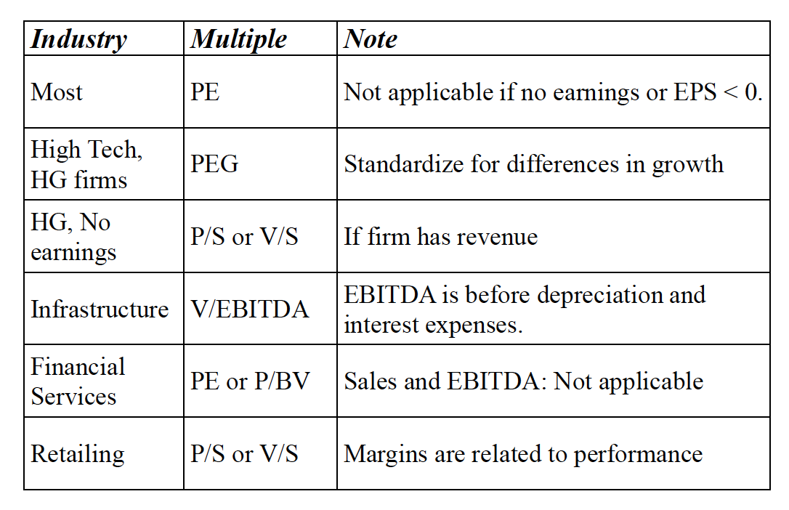

# Relative Valuation

- Implications
  - Comparable companies are fundamentally the same
  - Comparable companies are fairly priced

### Price/Earnings

- Definition: PE = market price per share / EPS
- Types
  - Current PE: P0 / EPS in the most current year (current EPS)
  - Trailing PE: P0 / EPS in trailing 12 months (trailing EPS)
  - Forward PE: P0 / Forecasted EPS (forward EPS)
  - EPS also differs depending on whether: (a) Earnings before of after extraordinary items, (b) Primary or diluted EPS
- Myth: low PE stocks are cheap, high PE stocks are expensive
  - Reason: disregard the growth potential
- Fundamental PE: $PE = \frac{1 - b}{k_e - g}$
- Determine PE
  - Regression approach
    - Conclusion is correct only if the assumptions are correct: comparable firms are fundamentally comparable, comparable firms are fairly valued
    - Hard to find comparable firms
  - Comparable firm approach
    - Relationship is not linear
    - The independent variables are independent with each other: select more companies
    - Have to use the most current regression

- PEG ratio: PE / (growth rate in earnings)
  - Consistency: PE and g, earnings used to calculate PE and g
  - $PEG = \frac{(1-b)(1+g) \times \left(1 - \frac{(1+g)^n}{(1+k)^n}\right)}{g(k-g)} + \frac{(1-b_n)(1+g)^n(1+g_n)}{n(k_n-g_n)(1+k)^n}$
  - Smallest firms have highest PEG ratios
  - Take the logarithm of g to linearize

### Value/EBITDA

- Reasons
  - Can be computed even net income is negative, since EBITDA > 0
  - For infrasturcture firms, substantial investment and long periods
  - In leverage buyouts, EBITDA measures the ability to payout debt
  - If the capex are unwise, can provide a better estimate of "optimal value"
  - Comparisons across firms with different leverage
- Definition
  - Classic definition: Value/EBITDA = (market value of equity + market value of debt) / EBITDA
  - No-cash definition: Value/EBITDA = (market value of equity + market value of debt - cash) / EBITDA
- Determinants: $Value/EBITDA = \frac{1 - t}{WACC - g} + \frac{[Dep(t) - Capex - \Delta WC]/EBITDA_1}{WACC - g}$

### Book Value Multiples

- Price-book value ratio: PBV =  price / book value = market value of equity / book value of equity
- Value/book value ratio: value / book value = market value of equity + debt (- cash) / book value of equity + debt
- Determinants
  - $\frac{P_0}{BV_0} = \frac{ROE - g}{k_e - g}$
  - $\frac{V_0}{BV_0} = \frac{ROC - g}{WACC - g}$

### Revenue Multiples

- Price Sales ratio: price / sales = market value of equity / total revenue
- Value/sales ratio: value / sales = market value of equity + debt (- cash) / total revenue
- Determinants:
  -  $P/S = \frac{net\ profit\ margin * (1-b) * (1 + g)}{k_e - g}$
  - $V/S = \frac{[OPM(1-t)](1-RIR)(1+g)}{WACC - g}$ where OPM(1-t) = after-tax operating margin, RIR = reinvestmetn rate
- Stocks are based on expected margins, rather than current margins (but we can only get current margins)

### Value of a Brand Name

- Implication: a brand can sell at higher prices, leading to higher profit margins and higher P/S ratios
- Assumption:
- Value of a brand name = [(V/S)\_b - (V/S)\_g] * sales

### Choice

- Sector based valuation: use multipliers to see if undervalued or overvalued
- Market based valuation: compare the valuation of the firm relative to the entire market

